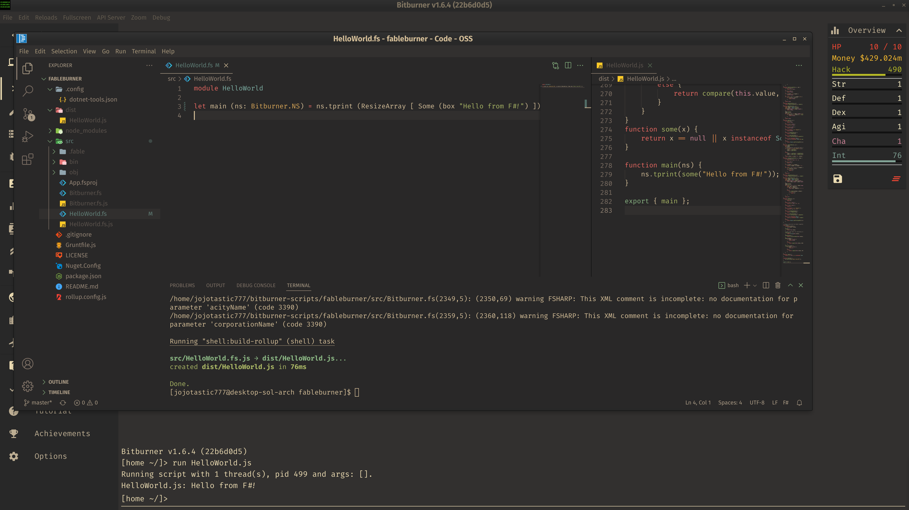

# fableburner
A template for writing [Bitburner](https://github.com/danielyxie/bitburner) scripts in [F#](https://fsharp.org/) using [Fable](https://fable.io/).

## Prerequisites
- `node` and `npm` (Needed for the javascript half of the build process.)
- `yarn` (Optional.)
- [.NET SDK](https://dotnet.microsoft.com/en-us/download/dotnet) (Needed for the F# half of the build process.)
- [Grunt](https://gruntjs.com), specifically `grunt-cli`.

## Setup
1. Run `npm install` or `yarn` to download dependencies.
2. Run `grunt get-types` to automatically pull Bitburner's Netscript types from github, and convert them to F# types.
    - Be sure to re-run this step every so often, to make sure your types are up to date.
    - If you would like to apply additional processing to the generated types, check out the `get-types` task in `Gruntfile.js`.

## Usage
- Run `grunt` (or `grunt build`) to build the F# files specified in `src/App.fsproj`.
    - Per-file output should show up in `src/`.
    - Bundled output should show up in `dist/`.
